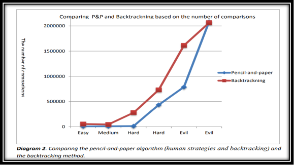

# Sudoku-Solver
This is a Project to solve the sudoku game using the concept of Backtracking Algorithm.

# Abbreviations and Definitions:  
In this essay we have tried to use the same    terminology, which is commonly used in other journals and research papers. In the following paragraph, there is a brief description of some the abbreviations and definitions that are used in the text.

Sudoku : Sudoku is a logic-based, combinatorial number placement puzzle. The word “Sudoku” is short for Su-ji wa dokushin ni kagiru (in Japanese), which means “the numbers must be single”.

Box (Region, Block): A region is a 3x3 box like the one. There are 9 regions in a traditional Sudoku puzzle.

Cell (Square): Square is used to define the minimum unit of the Sudoku board. 

Candidates: the number of possible values that can be placed into an empty square. 

Clues: the given numbers in the grid at the beginning.

Grid (board): The Sudoku board consists of a form of matrix or windows.

# Short About Sudoku
Sudoku is a logic-based puzzle that is played by numbers from 1 to 9. The Puzzle first appeared in newspapers in November 1892 in France and then Howard Garns an American architect presented it in its modern form [1,5]. There are already many journals, papers and essays that researched about Sudoku Solvers and most of them present different type of algorithms. Sudoku’s popularity is based on several reasons. First of all, it is fun and fascinating, and very easy to learn because of its simple rules. There are currently many different type of Sudoku puzzles, classic Sudoku that contains a 9X9 grid with given clues in various places, mini Sudoku that consists of a grid with 4X4 or 6X6 sizes. The other type of Sudoku is Mega Sudoku that contains a grid with 12X12 or 16X16 sizes . In this text, the focus is mostly on the classic Sudoku, i.e. 9X9 grid.

# Examined Algorithms
# Pencil-and-paper algorithm 
In this work, we implement a solution based on some strategies used by humans when solving the puzzle, therefore, it is called pencil-and-paper algorithm. The paper-and-pencil algorithm contains human strategies. These strategies have been examined below in more details. These techniques are almost easy to understand by human players, but it might be hard to search in the puzzle, since there are several things to look for at the same time. As there are puzzles with different types of difficulty, the easy and medium puzzles can be solved using some simple techniques such as unique missing method, naked singles. However, to solve difficult problems we may examine other techniques as well (locked candidates, naked and hidden pairs, triplets etc.)

# Backtracking (guessing method)
In order to solve puzzles with even more difficult levels such as hard and evil the backtracking method has been used to complete the algorithm. A human player solves the puzzle by using simple techniques. If the puzzle is not solvable by using the techniques the player, then tries to fill the rest of the empty squares by guessing.

The backtracking method, which is similar to the human strategy (guessing), is used as a help method to the pencil-and-paper algorithm. In other words, if the puzzle cannot be filled when using the unique missing method and the naked single method, the backtracking method will take the puzzle and fill the rest of empty squares. Generally, the backtracking method find empty square and assign the lowest valid number in the square once the content of other squares in the same row, column and box are considered. However, if none of the numbers from 1 to 9 are valid in a certain square, the algorithm backtracks to the previous square, which was filled recently.

